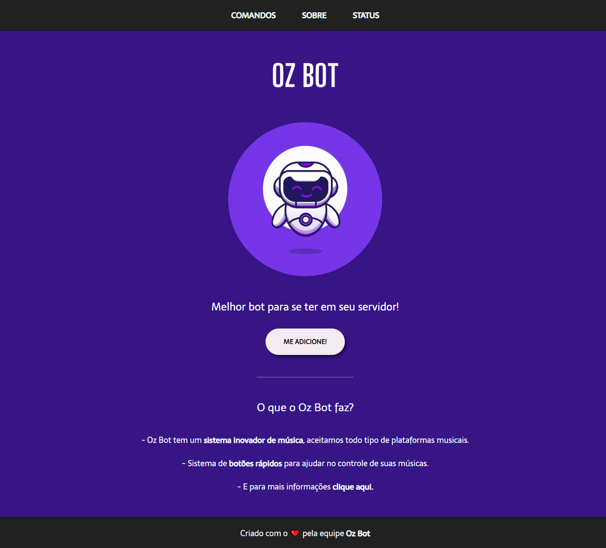

# Oz Bot

 

> Site de um bot de música para discord feito por um grupo de amigos. 
 
Projeto desenvolvido em HTML e CSS.

 

## 🤝 Colaboradores

Agradecemos às seguintes pessoas que contribuíram para este projeto:

<table>
  <tr>
    <td align="center">
      <a href="https://github.com/gabrielovski">
         
        
          <b>Gabriel</b>
        
      </a>
    </td>
    <td align="center">
      <a href="https://github.com/Mazuc0">
         
        
          <b>Mateus</b>
        
      </a>
    </td>
    <td align="center">
      <a href="https://github.com/eduxce">
         
        
          <b>Eduardo</b>
        
      </a>
    </td>
    <td align="center">
      <a href="https://github.com/ozBricio">
         
        
          <b>Fabrício</b>
        
      </a>
    </td>
  </tr>
</table>

[⬆ Voltar ao topo](#oz-bot) 
